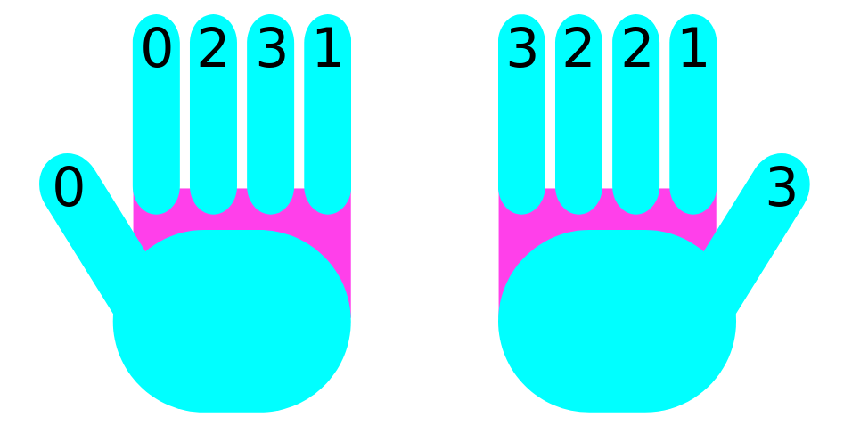

# ten fingers

A tool for people with diabetes to track which fingers were pricked recently.

## Usage

After you prick a finger for a blood sample, click that finger. The page will remember which day you clicked which finger, and show how many days it has been since you last clicked that finger.

This is a website. If you want it to look like an app on your phone, search "add website shortcut to phone home screen", and look for an article like [this one for iphone](https://www.howtogeek.com/667910/how-to-add-a-website-to-your-iphone-or-ipad-home-screen/) or [this one for android](https://www.howtogeek.com/667938/how-to-add-a-website-to-your-android-home-screen/).

Please use the [github issues form](https://github.com/heatherbooker/ten-fingers/issues/new) to ask questions or request features.

## Notes on the making of

This is a web remake of my earlier project with colleagues, the [unfinished android version](https://github.com/heatherbooker/DiabetesBuddy).

The hand images were made by me in [inkscape](https://inkscape.org/), a free drawing and editing program, which I highly recommend. I used their free tutorials and made a hand out of rounded rectangles. Can you tell? ;)

## Disclaimer

This is not medical advice, I am not a doctor, this website is simply a tool to help users manage one specific part of their care.
